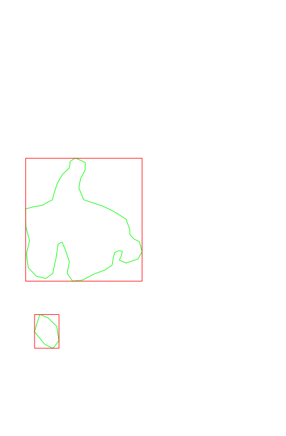

# Draw

Package draw provides APIs to draw and manipulate images.

Below are some real use cases.

## Mask and bounding box

## Acknowledgement

Most of the code here are taken and modified from

1. https://github.com/fogleman/contourmap
2. https://github.com/llgcode/draw2d

