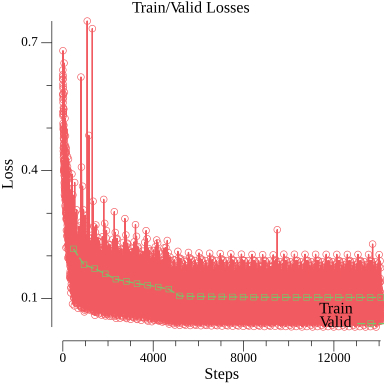

# HAM10000 - Skin Cancer Image Segmentation and Classification

This is a demonstration of using [sugarme/lab](https://github.com/sugarme/lab) toolkits to train image segmentation and classification tasks on [HAM10000 dataset](https://arxiv.org/abs/1803.10417).

A sample of training output can be found at [checkpoint/sample](checkpoint/sample)

## Retrieve data

The dataset can be downloaded from [Kaggle Ham10000 dataset of images and masks](https://www.kaggle.com/surajghuwalewala/ham1000-segmentation-and-classification). Masking images are created by a single dermatologist [Philipp Tschandl](https://www.kaggle.com/tschandl/ham10000-lesion-segmentations). 

Total samples = 10,015 images.

```bash
# Download with Kaggle CLI
kaggle datasets download  surajghuwalewala/ham1000-segmentation-and-classification
unzip ham1000-segmentation-and-classification.zip
```

## Segmentation

Image segmentation using the following configuration:
- Model: UNet ResNet34
- Pre-trained weights: ResNet34 pre-trained model on ImageNet dataset
- Batch size: 16
- Input image size: 224 x 224 pixels
- Epochs: 30
- Loss function: Dice Loss
- Valid metric: Dice Coefficient
- Optimizer: AdamW
- Initial LR: 3.0e-4
- Learning Rate Scheduler: StepLR (steps = 10 epochs, gamma = 0.1)
- Train/Valid split: 4:1 (80% training, 20% validating)
- Augmentation: data shuffling. No image augmentation yet.

```bash
# Training
go run . -task=segment-train -config=config-segmentation.yaml -full=true

# Inferring
go run . -task=segment-infer -file="FULL_PATH_TO_IMAGE_FILE" -model="MODEL_FILE" -create-mask=true

```

**Result**

Dice Coefficient is ~ 89.76% 

**train/valid losses**



## Classification

To be updated.


