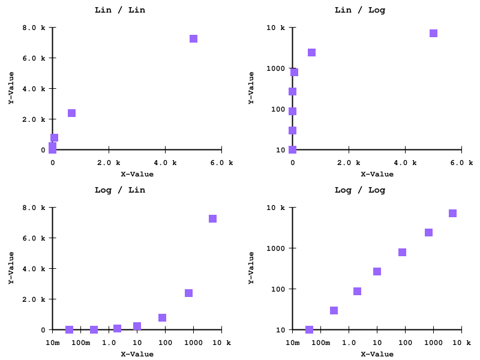
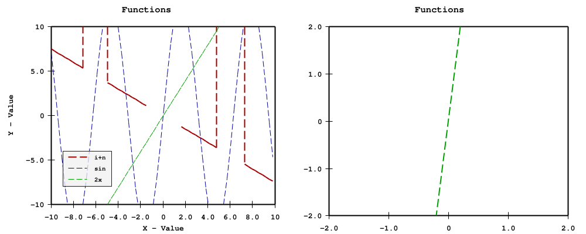

# Plot

Plot package provides ways to plot data to various type of graphics (image, text, svg).

Below are some examples of charts.

## Basic Charts

### Scatter Chart

### Bar Chart

### Pie Chart

### Histogram

###J Strip Chart

### Mieten Chart

### Graphic Text

## Chart Components

### Autoscale

### Axis

### Function

### Tic

### Kernel

## Real Usage Cases

### Train valid Loss

## Acknowledgement

Most of the code here are taken and modified from

1. https://github.com/vdobler/chart
2. https://github.com/ajstarks/svgo

